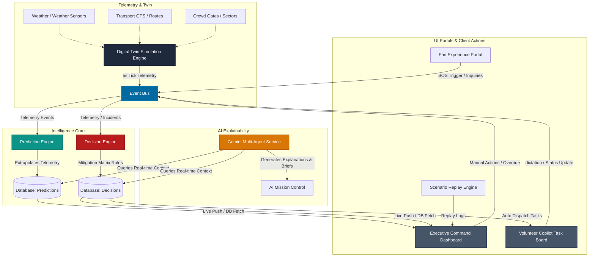

# 🏟️ ArenaMind AI: The Intelligent Stadium Operating System

[](https://fastapi.tiangolo.com)
[](https://nextjs.org)
[](https://www.docker.com)
[](https://cloud.google.com/run)
[](https://deepmind.google/technologies/gemini/)

**ArenaMind AI** is a premium, real-time stadium operations platform designed for **FIFA World Cup 2026** venues (such as Miami's Hard Rock Stadium). Powered by a reactive **Digital Twin Simulation**, a deterministic **Mitigation Decision Engine**, and specialized **Gemini AI Agents**, ArenaMind AI transitions stadium operations from passive telemetry monitoring into an active, self-healing command-and-control operating system.

---

## 🏗️ System Architecture

ArenaMind AI relies on a high-throughput, event-driven loop where the Digital Twin feeds real-time telemetry into a central Event Bus. This data flows through predictive and decision-making engines to dispatch tasks, manage incidents, and supply real-time WebSocket feeds to user-facing portals.



---

## ⚡ Deployed Production Improvements (Release Verification)

We have verified and resolved critical performance and integration bugs to ensure the codebase is 100% production-ready:

1. **CORS Preflight Sanitization**: Configured wildcard headers on backend endpoints to allow cross-origin requests from frontends hosted on Next.js environments (Vercel) to backends on Render.
2. **Double-Slash URL Cleanup**: Re-architected URL formatting inside the frontend constants helper to dynamically strip trailing slashes, preventing malformed preflight routes.
3. **Database Lifespan Self-Healing**: Added automated database schema checks during application startup. If a new Postgres or SQLite instance is detected with zero records, the backend automatically seeds all test profiles and default simulator telemetry.
4. **React Hook Closure Optimizations**: Refactored `useWebSocket`, `useStreamingChat`, `useSpeechRecognition`, and `useAuth` hooks to maintain callback states in mutable Refs. This isolates state logic, prevents infinite connection cycles, and improves typing input performance.

---

## 📸 Core Operations Portals

ArenaMind AI features four custom role-based portals tailored to stadium managers, volunteers, fans, and analytical replays:

1. **🏟️ Executive Command Dashboard** (`/operations`)
   * **Visual composite health index** aggregating telemetry into a stadium-wide status score.
   * **Stadium Heatmap** with color-coded overlays displaying crowd densities per sector.
   * **Active Timeline Console** streaming telemetry logs and incidents chronologically.
   * **AI Mission Control Desk** providing live analysis from specialized Gemini agents, complete with mitigation logic.

2. **📱 Fan Experience Portal** (`/fan`)
   * Mobile-first layout with interactive seat navigators and gate proximity displays.
   * **Queue Wait Forecast Engine** highlighting queue times at concessions and stadium gates.
   * **AI Digital Assistant** integrated with the Web Speech API for voice control and queries.
   * **Emergency SOS Trigger** permitting rapid reporting of local issues.

3. **🤝 Volunteer Copilot** (`/volunteer`)
   * Offline-first layout (utilizing LocalStorage caching) designed for field support.
   * **Prioritized Task Board** tracking tasks assigned by the Command Center.
   * **GPS Concourse Navigation Waypoints** guiding volunteers directly to hot spots.
   * Voice issue dictation and media upload indicators for simple reporting.

4. **⏱️ Scenario Replay Engine** (`/replay`)
   * Historical incident cockpit displaying chronological replays of past scenarios.
   * Interpolated frame-by-frame play/pause playback controls and speed adjustments.
   * Dynamic historical heatmaps synchronized with line charts of resource load.

---

## 🧠 The Digital Intelligence Engines

### 1. Digital Twin Simulation Engine
Located in [twin.py](file:///c:/IT/Hackathons/PromptWars4/backend/app/engine/twin.py), this background engine runs every 5 seconds, driving all simulation variables:
* **Crowd Dynamics**: Simulates spectator density waves (ingress/egress) per sector.
* **Turnstile Gates**: Models queue lengths, service speeds, and turnstile malfunctions.
* **Transit Fleet**: Real-time simulation of train, shuttle, and bus routes with occupant counts and delays.
* **Infrastructure Energy**: Computes zone electrical draw (lighting, HVAC, solar offsets) and tracks carbon footprint metrics.
* **Weather Stress**: Simulates temperatures, humidity, and calculates live Heat Index/UV Index stress vectors.
* **Probabilistic Events**: Generates medical alerts and security perimeter breaches based on weather and crowd density metrics.

### 2. Predictive Intelligence Engine
Located in [prediction.py](file:///c:/IT/Hackathons/PromptWars4/backend/app/engine/prediction.py), this engine maintains a sliding telemetry history (last 10 ticks) and makes predictions across 8 core categories:
1. **Crowd Congestion**: Forecasts sector-wide density gridlocks.
2. **Gate Queue Growth**: Extrapolates turnstile bottlenecks.
3. **Parking Forecast**: Projects lot fill rates and time-to-full values.
4. **Transport Delay**: Predicts shuttle delays due to passenger overloads.
5. **Volunteer Demand**: Models volunteer-to-spectator ratio shortages.
6. **Medical Load**: Forecasts heat stress/collapse cases using the simulated Heat Index.
7. **Energy Forecast**: Forecasts grid zone active power spikes.
8. **Carbon Projection**: Projects cumulative operational emissions.

### 3. Rules-Based Decision Engine
Located in [decision.py](file:///c:/IT/Hackathons/PromptWars4/backend/app/engine/decision.py), the engine evaluates incoming predictions and incidents against a **Deterministic Mitigation Matrix**:
* **CLOSE_GATES**: Initiates lockdowns on turnstiles in the event of security breaches.
* **OPEN_GATES**: Automatically triggers manual auxiliary scanner lanes during gate malfunctions.
* **DISPATCH_VOLUNTEERS**: Assigns crowd control and wayfinding teams to high-density zones.
* **MEDICAL_ESCALATION**: Dispatches roaming medical personnel to heat stress incidents.
* **TRANSPORT_DIVERSION**: Redirects shuttle fleets around traffic delays to maintain headways.
* **PARKING_REDIRECTION**: Updates digital boards to direct vehicles to available lots.

### 4. Gemini Multi-Agent Explainability Service
Located in [gemini.py](file:///c:/IT/Hackathons/PromptWars4/backend/app/services/gemini.py), this service powers AI Mission Control by configuring **8 specialized Gemini agents** (via `gemini-1.5-flash`):
* `Crowd Intelligence Agent` — Analyzes sector congestion and bottleneck anomalies.
* `Volunteer Copilot Agent` — Translates command center decisions into task boards.
* `Medical Response Agent` — Examines heat indices and drafts triage dispatch descriptions.
* `Security Agent` — Scans incident logs to draft security briefings.
* `Accessibility Agent` — Outlines wheelchair ramps, sensory rooms, and elevators.
* `Transportation Agent` — Monitors shuttle headways and schedules.
* `Sustainability Agent` — Evaluates energy grids and solar offsets.
* `Executive Insights Agent` — Compiles strategic stadium-wide health summaries.

> [!NOTE]
> When `GEMINI_API_KEY` is absent or unconfigured, the service cascades to a robust local rule-based templating fallback, maintaining continuous operation.

---

## 🛠️ Technical Stack

### Backend
* **FastAPI**: Asynchronous REST API framework.
* **SQLAlchemy & Alembic**: Database ORM and migrations.
* **PostgreSQL / SQLite**: High-performance primary database, with an auto-falling-back SQLite configuration for local development.
* **EventBus**: High-throughput message broker coordinating simulation ticks, predictions, and decisions.

### Frontend
* **Next.js & React**: Modern app routing and components.
* **TailwindCSS**: Premium responsive styles.
* **Zustand**: Clean state management.
* **Recharts**: Beautiful live telemetry charts.
* **Lucide React**: Premium icon sets.

---

## 📂 Repository Structure

```
/
├── backend/                      # FastAPI Application
│   ├── app/                      # Main application package
│   │   ├── bus/                  # Event Bus broker, schemas, and router
│   │   ├── core/                 # Middleware and error handling modules
│   │   ├── engine/               # Twin, Prediction, and Decision engines
│   │   ├── routers/              # API routers (auth, incidents, tasks, fan, etc.)
│   │   ├── schemas/              # Pydantic schemas
│   │   ├── services/             # Gemini service integrations
│   │   ├── config.py             # App configurations and defaults
│   │   ├── database.py           # SQLAlchemy setup
│   │   ├── models.py             # Database model declarations
│   │   └── main.py               # Main API entrypoint
│   ├── tests/                    # Pytest suite
│   ├── Dockerfile
│   └── requirements.txt
│
├── frontend/                     # Next.js Application
│   ├── app/                      # Next.js App Router views (fan, operations, etc.)
│   ├── components/               # Custom UI Components
│   │   ├── dashboard/            # Health indices, maps, heatmaps, and AI Mission Control
│   │   ├── fan/                  # Assistant views and emergency forms
│   │   ├── replay/               # Synchronized replay controls
│   │   └── volunteer/            # Offline tasks and navigation
│   │   types/                    # TypeScript models
│   ├── Dockerfile
│   └── package.json
│
├── .github/workflows/deploy.yml  # GCP CI/CD Pipeline
├── cloudbuild.yaml               # Google Cloud Build deployment script
└── docker-compose.yml            # Multi-container local orchestration
```

---

## 🚀 Local Development (Quick Start)

### 1. Environment Configurations
Create a `.env` file in the `backend/` directory to configure environment parameters. You can copy the template from [backend/.env.example](file:///c:/IT/Hackathons/PromptWars4/backend/.env.example):
```ini
APP_ENV=development
SECRET_KEY=stadium_secret_key_here

# Local SQLite Database (Defaults to arenamind.db in the directory)
DATABASE_URL=sqlite:///./arenamind.db

# Optional Firebase Configurations
FIREBASE_DATABASE_URL=https://your-app-db.firebaseio.com
FIREBASE_CREDENTIALS_JSON_PATH=path/to/firebase-credentials.json

# Gemini Configurations
GEMINI_API_KEY=your_gemini_api_key_here
```

### 2. Launch with Docker Compose (Recommended)
Launch the database, backend services, and Next.js frontend together:
```bash
docker-compose up --build
```

Access the system entrypoints:
* 🌐 **Landing Page**: `http://localhost:3000`
* 🏟️ **Operations Dashboard**: `http://localhost:3000/operations`
* 📱 **Fan Portal**: `http://localhost:3000/fan`
* 🤝 **Volunteer Copilot**: `http://localhost:3000/volunteer`
* ⏱️ **Scenario Replayer**: `http://localhost:3000/replay`
* 🔌 **API Documentation**: `http://localhost:8000/docs`

### 3. Running Manually (Without Docker)

#### Setup Backend
1. Navigate to the backend directory and set up a virtual environment:
   ```bash
   cd backend
   python -m venv venv
   source venv/bin/activate  # On Windows: venv\Scripts\activate
   ```
2. Install the requirements:
   ```bash
   pip install -r requirements.txt
   ```
3. Run migrations or initial seeds:
   ```bash
   python -m app.seed
   ```
4. Start the FastAPI server:
   ```bash
   uvicorn app.main:app --reload --port 8000
   ```

#### Setup Frontend
1. Navigate to the frontend directory:
   ```bash
   cd frontend
   ```
2. Install npm dependencies:
   ```bash
   npm install
   ```
3. Launch the development server:
   ```bash
   npm run dev
   ```

---

## 👥 Demo Credentials
ArenaMind AI uses role-based authentication. Test the system using the following seeded emails (no password required for local development):

| Role | Email | Best For |
| :--- | :--- | :--- |
| **OPERATIONS** | `manager@fifa.com` | Accessing the Operations Dashboard, Override Commands |
| **VOLUNTEER** | `volunteer1@fifa.com` | Managing tasks on the Volunteer Copilot |
| **MEDICAL** | `medical1@fifa.com` | Escalating and triaging heat stress reports |
| **FAN** | `fan1@gmail.com` | Inquiring via Voice AI, triggering SOS reports |

---

## 🧪 Testing Harness

To execute the backend test suite:
1. Navigate to the backend directory:
   ```bash
   cd backend
   ```
2. Run tests with coverage reporting:
   ```bash
   pytest --cov=app tests/ -v
   ```

---

## 🌐 Production Deployment

ArenaMind AI is optimized for deployments on **Google Cloud Platform (GCP)** via **Google Cloud Run** using Google Artifact Registry and Secret Manager. 

Detailed step-by-step instructions (Cloud Build configuration, Secret setup, and GitHub Actions CD) can be found in the [DEPLOYMENT_GUIDE.md](file:///c:/IT/Hackathons/PromptWars4/DEPLOYMENT_GUIDE.md) document.
